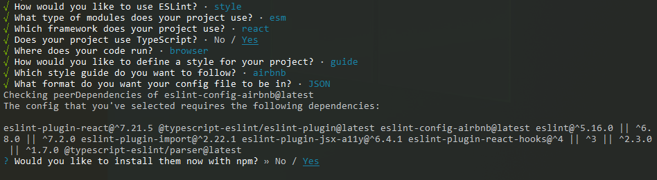
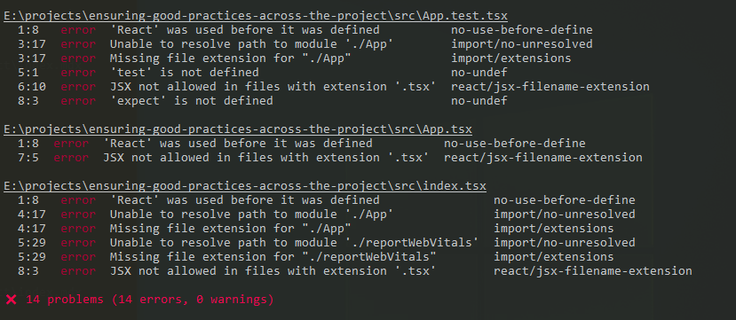
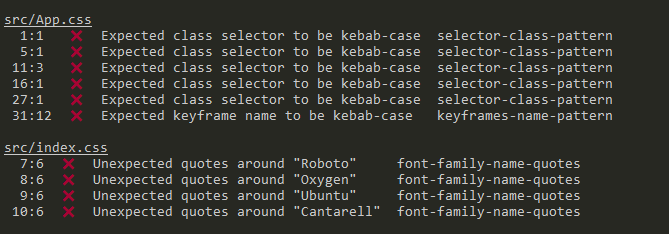
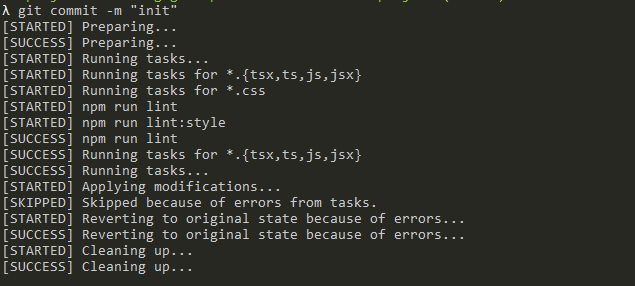
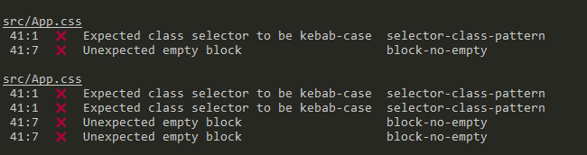
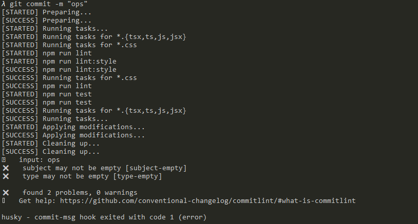

## The reason

When you are creating something more complicated than a few commits, you will usually wonder - what structure will be the best, X or Y testing library, maybe Angular over React, do we use OOP or FP?

Well, that's harder to say than just agreeing on a fact that doesn't matter what you choose - you want everyone else (and you too) to stick with that choice, and the same applies to any coding conventions, folder structure, naming, or anything else.

Unfortunately, you can't block people from committing unmaintainable or poorly designed code (you can do that by enforcing proper code reviews culture).
At least you can validate if written code is in a valid format, passes tests, and has a proper commit structure.

Floating your pull request with dozen comments about formatting or leaving console logs somewhere is not desired goal of a code review and is not productive in any way.

Another point is that you don't want to take care of formatting your code manually. Anything that can be automated and can help in speeding up the development process and its quality is a goto.

You want to achieve as bulletproof and forgiving process as you can. At least in some sense - you will be yelled at on every possible stage if you do something wrong. But these mistakes won't slip further, and you will be aware of what can go wrong in the future.


## Starting with CRA, eslint and prettier

For this example, ill create a new [create-react-app for a quick](https://create-react-app.dev/) - easy React and Typescript setup. Other libraries/ frameworks base setup should be similar.

```sh
npx create-react-app project-name --template typescript --use-npm
```

When project is instaled `cd` to new directory and install [eslint](https://eslint.org/) and [prettier](https://prettier.io) with related packages

```sh
npm install --save-dev eslint eslint-config-prettier eslint-plugin-prettier prettier
```

Initialize eslint with `npx eslint --init` and select your preferred options with eslint CLI, this is my configuration:



After this step, you should have a file eslint configuration file. In my case this is the output:

```json
{
  "env": {
    "browser": true,
    "es2021": true
  },
  "extends": [
    "plugin:react/recommended",
    "airbnb"
  ],
  "parser": "@typescript-eslint/parser",
  "parserOptions": {
    "ecmaFeatures": {
      "jsx": true
    },
    "ecmaVersion": 13,
    "sourceType": "module"
  },
  "plugins": [
    "react",
    "@typescript-eslint"
  ],
  "rules": {}
}
```

Time to add prettier configuration for eslint:
  - extend with `"extends": [plugin:prettier/recommended]`
  - add prettier plugin `"plugins": ["prettier"]`
  - add `"prettier/prettier": "error"` for rules

```json
{
  "env": {
    "browser": true,
    "es2021": true,
    "jest": true
  },
  "extends": [
    "plugin:react/recommended",
    "airbnb",
    "plugin:import/typescript",
    "plugin:prettier/recommended"
  ],
  "parser": "@typescript-eslint/parser",
  "parserOptions": {
    "ecmaFeatures": {
      "jsx": true
    },
    "ecmaVersion": 13,
    "sourceType": "module"
  },
  "plugins": ["react", "@typescript-eslint", "prettier"],
  "rules": {
    "prettier/prettier": "error"
  }
}
```

We are almost ready to run our first check - it's time to add scripts, prettier configuration, and additional setup for ignoring files.

Create .prettierrc file with confiuration that suits you, my default is:

```json
{
  "semi": true,
  "singleQuote": false,
  "endOfLine": "auto"
}
```

Create .eslintignore, and .prettierignore files with directories that should not be checked. In my case both are the same:

```json
node_modules
yarn.lock
package-lock.json
public
build
README.md
```

The last part is to add scripts that can run linters - add this command to package.json scripts section:

```json
  "lint": "eslint ./src --ext tsx,ts,js,jsx --fix", // configure path and extensions that you need
```

Time to run linting with `npm run lint` script.



Whoops, it appears there are some errors - don't worry, sometimes rules from different plugins need to be adjusted for some setups. If it's the case for you - google should be able to answer your problems.

In my case - adjusting configuration this way fixed all the problems:

```json
{
  "env": {
    "browser": true,
    "es2021": true,
    "jest": true
  },
  "extends": [
    "plugin:react/recommended",
    "airbnb",
    "plugin:import/typescript",
    "plugin:prettier/recommended"
  ],
  "parser": "@typescript-eslint/parser",
  "parserOptions": {
    "ecmaFeatures": {
      "jsx": true
    },
    "ecmaVersion": 13,
    "sourceType": "module"
  },
  "plugins": ["react", "@typescript-eslint", "prettier"],
  "rules": {
    "prettier/prettier": "error",
    "no-use-before-define": "off",
    "@typescript-eslint/no-use-before-define": ["error"],
    "react/jsx-filename-extension": [
      2,
      { "extensions": [".js", ".jsx", ".ts", ".tsx"] }
    ],
    "import/extensions": [
      "error",
      "ignorePackages",
      {
        "js": "never",
        "jsx": "never",
        "ts": "never",
        "tsx": "never"
      }
    ]
  }
}
```

## Adding stylelint

After js liting is ready - it's time for the next step. Doesn't matter if you decided to use css3 or any pre/post-processor - [stylelint](https://stylelint.io/user-guide/get-started) has you covered.

For anything else that css3 you can follow with stylelint guides, in this case I'm fine with bare minimum setup.

Install dependencies:

```sh
npm install --save-dev stylelint stylelint-config-standard stylelint-config-prettier
```

Create new `.stylelint.rc` file with the follwoing content:

```json
{
  "extends": ["stylelint-config-standard", "stylelint-config-prettier"]
}
```

Add scripts to `package.json`:

```json
  "lint:style": "stylelint ./src/**/*.css --fix" // automatically fix problems for all .css in the src folder
```

Run script `npm run lint: style`.

Most of the problems will be fixed, but not all of them:



Changing class names or declarations is not something that can be done safely by linter itself. After you fix that manually - linting will pass.

## Wrapping linters with lint-staged

When you have the basic linting setup done - it's time to ensure you don't have to run it manually every time before you push some changes to the remote repository.

For this job [lint-staged](https://github.com/okonet/lint-staged) with git-hooks are perfect match.

Run init command:

```sh
npx mrm@2 lint-staged
```

After setup is done you should notice new `.husky` ([husky is handling our git-hooks](https://github.com/typicode/husky)) folder in the root directory and `lint-staged` configuration inside `package.json`.

```json
"lint-staged": {
  "*.{tsx,ts,js,jsx}": "eslint --cache --fix",
  "*.css": "stylelint --fix"
}
```

Configuration is almost what we want - file extensions are fine, commands should be adjusted to what we have in scripts section:

```json
"lint-staged": {
  "*.{tsx,ts,js,jsx}": "npm run lint",
  "*.css": "npm run lint:style"
}
```

Its time to test if we got this part right:
1. `git add -A` - which will add all files for commit
2. `git commit -m "init"`
3. Now lint-staged should run all linting, since we have css and js - both commands will be run.



In my case lint-staged got triggered on commit, but linting failed - its ok, I got errors that i made intentinally (added empty class starting with uppercase).



## Testing every commit with jest

In this case, we don't need any setup for testing framework - [jest](https://jestjs.io/) is included in CRA by default.

Our job is simple - add new test script in package.json (default one for CRA is in watch mode):

```json
"test:watch": "react-scripts test",
"test": "react-scripts test --watchAll=false"
```

And extend lint-staged configuration in package.json with test command:

```json
"lint-staged": {
  "*.{tsx,ts,js,jsx}": ["npm run lint", "npm run test"],
  "*.css": "npm run lint:style"
}
```

Now every commit will be validated with linters and tests (order of commands does matter).

## Adding commitlint for forcing commits format

After code validation is ready - it's time for commit message validation.

If you ever worked in a team - you have probably seen commit messages like - "changes", "fix", "ops", etc..

What is the author's intention you might wonder - I did too. It gets even worse when you have to find some change related to a certain ticket that should be fixed or reverted and the repository had a lot of changes...

There is a way to prevent that with [commitlint](https://github.com/conventional-changelog/commitlint) setup and [conventional commits](https://www.conventionalcommits.org/en/v1.0.0/).

Start with adding dependencies:

```sh
npm install --save-dev @commitlint/config-conventional @commitlint/cli
```

Add a new config file for commitlint - `commitlint.config.js` inside root direcotry:

```js
module.exports = { extends: ["@commitlint/config-conventional"] };
```

Then create a new file `commit-msg` inside `.husky` directory with this content:

```sh
#!/bin/sh
. "$(dirname "$0")/_/husky.sh"

npx --no-install commitlint --edit "$1"
```

Now add any files and try to commit with invalid message:



The message got validated and the commit has been blocked.

After fixing an invalid message the commit will pass and you will be able to push changes.

If you wonder how the final setup looks like - you can visit [repository](https://github.com/m-zs/ensuring-good-practices-across-the-project)
